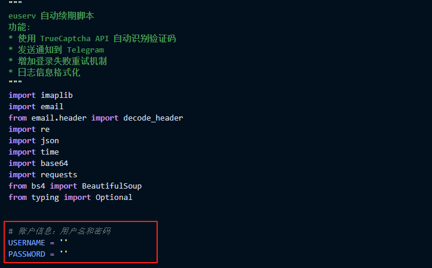
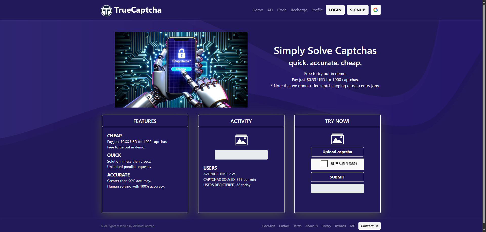
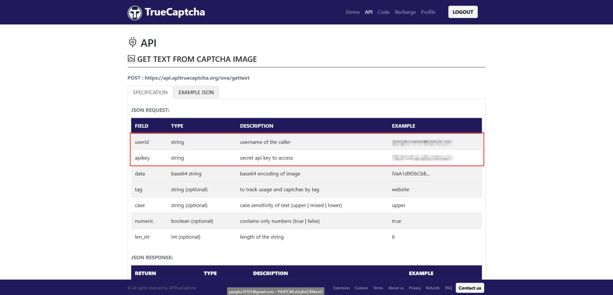
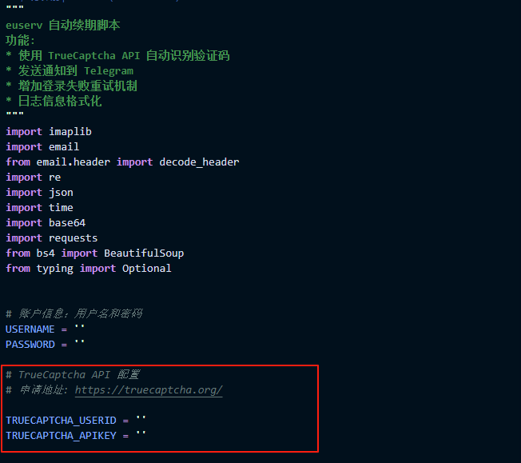
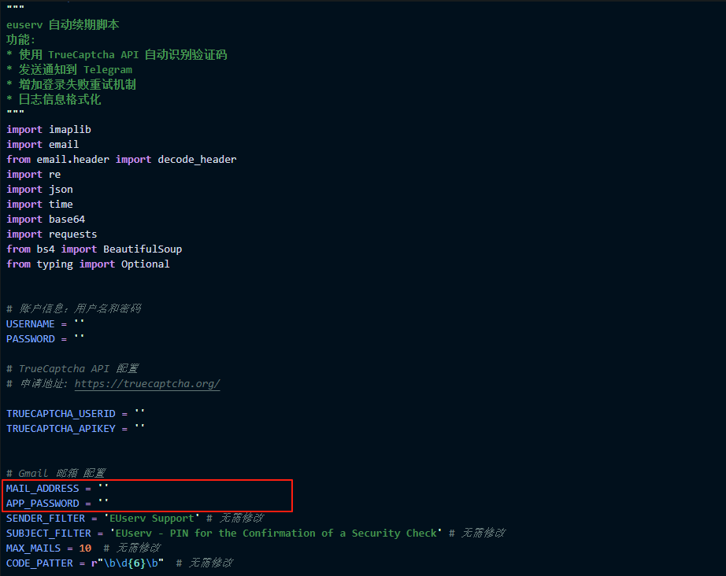
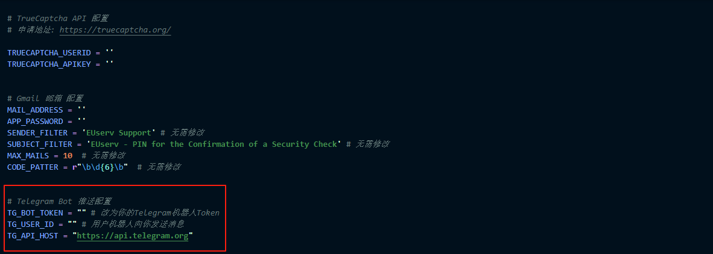

<!--
 * @Author: Linqh
 * @Date: 2025-07-20 00:03:32
 * @LastEditors: Linqh
 * @LastEditTime: 2025-07-20 12:43:50
 * @Description:
 *
-->

# AutoEUServerless

AutoEUServerless 是一个用于自动续期 EUserv 免费 IPv6 VPS。项目目的是简化续期过程，避免因遗忘续期而导致服务中断。

## 功能

- **自动续期**：自动获取账号内所有的 VPS 项目，并检测是否需要续期。
- **单账户支持**：只支持单个账户支持，配置了单个从 Euserv 绑定的邮箱获取验证码。因为只能绑定单个邮件服务器
- **自动获取 PIN 码**：设置邮箱应用专属密码获取未读邮件内容并解析出 PIN 码。
- **验证码识别**：自动识别登录过程中的验证码。
- **Telegram 通知**：通过 Telegram Bot 发送续期状态通知。

## 使用说明

大家都应该有一只德鸡,即乌龟壳之后唯一的一个永久免费 VPS。  
但是头疼的是必须每个月要续订,而且本身就是白嫖鸡,难道要再开一个鸡跑脚本来给它续订?  
于是本项目诞生了,自动续订你的德鸡并且对接 Telegram 推送!

## 使用说明

已添加 Github Action 模板,更加方便的使用,也可补充德机，让德机给自己续费,自行修改 Action Secrets 即可,推荐有基础的用户使用,暂时没精力写教程

## 致谢

特别感谢以下项目和文章对本项目的启发和帮助：

- [eu_ex](https://github.com/lw9726/eu_ex)
- [EUserv_extend](https://github.com/o0oo0ooo0/EUserv_extend)
- [AutoEUServerless](https://github.com/WizisCool/AutoEUServerless)

## 许可

本项目基于 GPL-3.0 许可协议。

## 如何使用

1.  **在 EUserV 中关闭登录二次验证!**  
    

    - 进入 EuserV 的管理面板,点击[**Settings**] -> 勾选 [**Deactivated (insecure)**] -> 点击[**Save**]

2.  **配置 EuserV 账户、密码至 main.python 文件**
    

3.  **注册 或 登录 二维码 解码平台 !**
    

    - 有账号点击 点击[**LOGIN**]，没有账号点击 [**SIGNUP**] 注册账户

4.  **获取 解码平台 API 配置**
    

    - 复制 userID、apikey 复制填入 main.py 文件
    - **推荐充值 1 USD 以免验证码次数不够登录失败**

    

    - 复制 userID、apikey 复制填入 main.py 文件

5.  **设置邮件服务器配置 此处以 Gmail 演示**
    

    - 设置谷歌邮箱
    - 去设置谷歌应用专属密码，把密钥填入 APP_PASSWORD

6.  **设置 Telegram Bot 提醒 可选**
    

#### 现在你可以毫无顾虑的让你的 🐥 小鸡吃灰了
